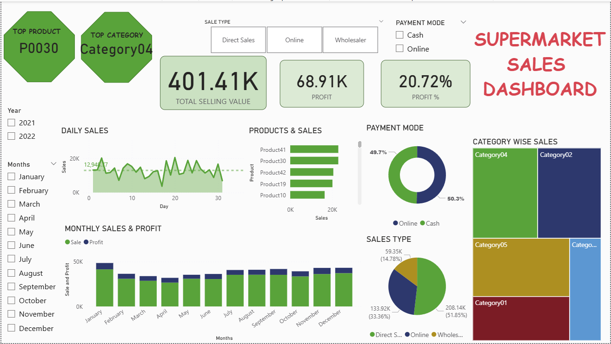

# 🛒 Supermarket Sales Dashboard — Power BI

## 📊 Project Overview
This project is an interactive Supermarket Sales Dashboard built using Power BI.  
The report analyzes sales performance, profit trends, payment behaviour, product performance, and category-wise contribution to help understand business growth and customer patterns.

---

## 🎯 Objectives
- Monitor Total Sales, Profit, and Profit %
- Track Daily and Monthly Sales trends
- Analyze Payment Modes (Online vs Cash)
- Identify Top Products and High-Performing Categories
- Create an executive-style storyboard summary

---

## 🧰 Tools & Skills Used
- Power BI Desktop
- Data Cleaning & Transformation
- DAX Measures
- Data Modeling
- Dashboard Design & Storytelling

---

## 📈 Key Dashboard Features
✔ KPI Cards (Total Sales, Profit, Profit %)  
✔ Daily Sales Trend with Average Reference Line  
✔ Monthly Sales vs Profit Analysis  
✔ Product-wise Sales Comparison  
✔ Payment Mode Distribution  
✔ Category-wise Sales Treemap  
✔ Interactive Year, Month, and Sales Type Filters  
✔ Executive Summary / Storyboard Page

---

## 🧠 Key Insights
- Category04 contributes the highest share of total sales.
- Product P0030 is the top-performing product.
- Online and Cash payments show a balanced distribution.
- Daily sales remain close to the average trend with periodic peaks.

---

## 📷 Dashboard Preview

---

## 🚀 How to Use
1. Download the `.pbix` file from this repository.
2. Open using Power BI Desktop.
3. Interact with slicers and visuals to explore insights.

---

## 👩‍💻 Author
Power BI Portfolio Project created as part of a data analytics learning journey.
